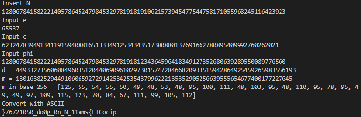

# Mind your Ps and Qs

## Description

In RSA, a small e value can be problematic, but what about N? Can you decrypt this? [values](./values)

## Hints

1. Bits are expensive, I used only a little bit over 100 to save money

## Approach

Here are the contents of values:

```text
Decrypt my super sick RSA:
c: 62324783949134119159408816513334912534343517300880137691662780895409992760262021
n: 1280678415822214057864524798453297819181910621573945477544758171055968245116423923
e: 65537
```

....RSA is mean. Just a personal opinion but whatever.
First I *ethically* stole some code from [here](https://crypto.stackexchange.com/questions/19915/rsa-decryption-given-n-e-and-phin)
I modifed the [code](https://github.com/vivian-dai/PicoCTF2021-Writeup/blob/main/Cryptography/javacodebad/RSA.java) a little bit.
Using [this](https://www.alpertron.com.ar/ECM.HTM) website, it took about 20 minutes or so to find the Euler's totient for n which was 1280678415822214057864524798453297819181234364596418349127352680639289550089776560
I ran the slightly modified [code](https://github.com/vivian-dai/PicoCTF2021-Writeup/blob/main/Cryptography/javacodebad/RSA.java) which probably would have been better if it wasn't in Java but that's fine. It works.



It appears that the flag is reversed: `}76721050_do0g_0n_N_11ams{FTCocip`. That's fine, simple fix.
I ran a [Python script](./script.py)

## Flag

picoCTF{sma11_N_n0_g0od_05012767}
