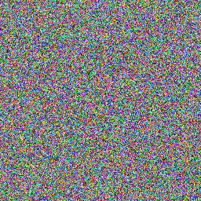
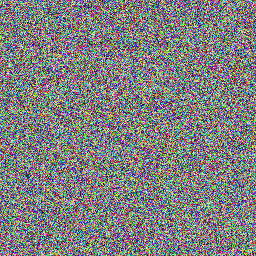
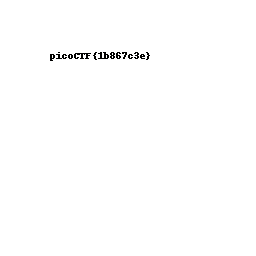

# Pixelated

## Overview

Points: 200
Category: Cryptography

## Description

I have these 2 images, can you make a flag out of them? [scrambled1.png](./scrambled1.png) [scrambled2.png](./scrambled1.png)

## Hints

1. [https://en.wikipedia.org/wiki/Visual_cryptography](https://en.wikipedia.org/wiki/Visual_cryptography)
2. Think of different ways you can "stack" images

## Approach

I downloaded [stegsolve](https://github.com/eugenekolo/sec-tools/blob/master/stego/stegsolve/stegsolve/stegsolve.jar). Make sure [Java](https://www.java.com/en/download/help/index_installing.html) is installed.

I opened the stegsolve jar file. In the jar file, I opened

File > Open(O)

I then overlayed

on top.
Analyse > Image Combiner

I went through a bunch of different adding methods before ADD finally worked.

## Flag

picoCTF{1b867c3e}
