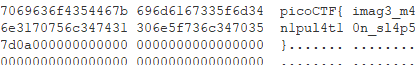

# Milkslap

Disclaimer: I did not solve this during pico. Overall approach was taught by a friend.

## Overview

Category: Forensics
Points: 120

## Description

[🥛](http://mercury.picoctf.net:7585/)

## Approach

Ctrl + shift + I on the website of milkslap and track down where the image is [located](http://mercury.picoctf.net:7585/concat_v.png)

Use the [one and only stegsolve](https://github.com/eugenekolo/sec-tools/tree/master/stego/stegsolve/stegsolve) and:

Analyze > Data Extract

then select `Blue 0` and click preview, scroll to the top:

## Flag

picoCTF{imag3_m4n1pul4t10n_sl4p5}
