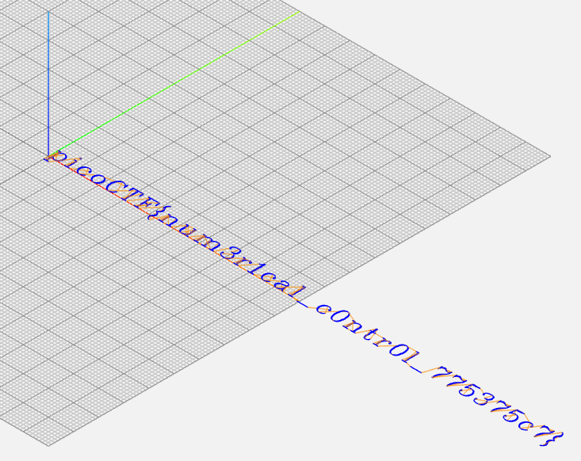

# speeds and feeds

## Overview

Points: 50
Category: Reverse Engineering

## Description

There is something on my shop network running at mercury.picoctf.net:53740, but I can't tell what it is. Can you?

## Hints

1. What language does a CNC machine use?

## Approach

Connecting to `mercury.picoctf.net:53740` (through web) results in [instructions.gcode](./instructions.gcode)

A quick Google search says a CNC machine uses GCode which can have a file extension of `.gcode` so I pasted that section of code into a text editor and saved it as a `.gcode` file. [NC Viewer](https://ncviewer.com/) can view GCode files:

## Flag

picoCTF{num3r1cal_c0ntr0l_775375c7}
