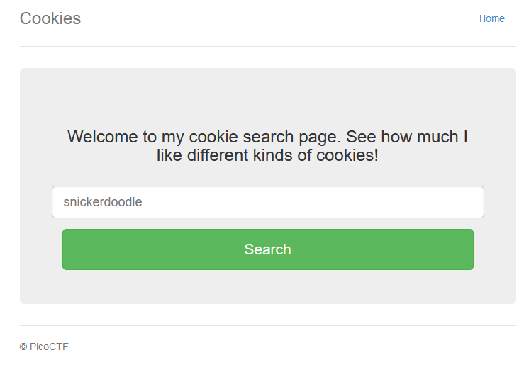
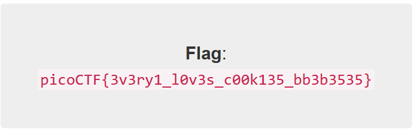

# Cookies

## Overview

Points: 40
Category: Web Exploitation

## Description

Who doesn't love cookies? Try to figure out the best one. [http://mercury.picoctf.net:17781/](http://mercury.picoctf.net:17781/)

## Hints

(None)

## Approach

The link goes to something that looks like this:

I typed in "snickerdoodle" and entered it.
> I love snickerdoodle cookies!

Ctrl + Shift + I will reveal some things, navigate to storage, then find cookies storage.

I noticed there's a grand total of one cookie with a value of 0. I changed the value to 1 and refreshed the page.
> I love chocolate chip cookies!

I kept increasing the numeric value of value by 1 until at 18, it gave the flag:

## Flag

picoCTF{3v3ry1_l0v3s_c00k135_bb3b3535}
