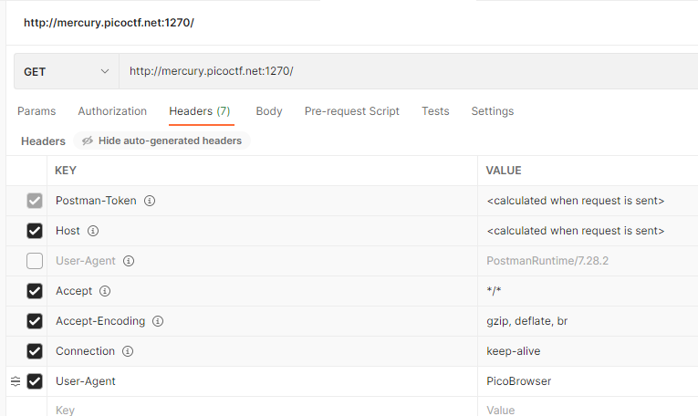
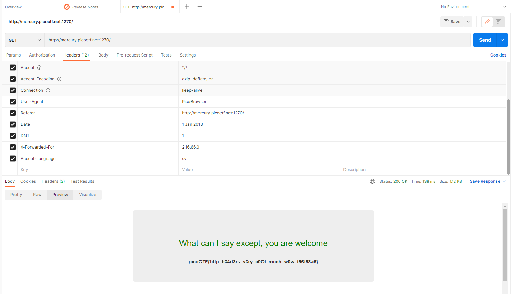

# Who are you?

## Description
Let me in. Let me iiiiiiinnnnnnnnnnnnnnnnnnnn [http://mercury.picoctf.net:1270/](http://mercury.picoctf.net:1270/)

## Hints
1. It ain't much, but it's an RFC https://tools.ietf.org/html/rfc2616

## Approach
### PicoBrowser
When we visit the site, it says
> Only people who use the official PicoBrowser are allowed on this site!

There are many ways to approach this (some alternatives are [`curl`](https://curl.se/) and [burp suite](https://portswigger.net/burp)) but I ended up using [Postman's](https://www.postman.com/) [HTTP request](https://learning.postman.com/docs/getting-started/sending-the-first-request/). We'll unhide requests and override the default [User-Agent](https://developer.mozilla.org/en-US/docs/Web/HTTP/Headers/User-Agent) request with a PicoBrowser agent.

### Another Site
> I don't trust users visiting from another site.

Now, we need to make the header show it's from the same site. We'll use a key of [Referer](https://developer.mozilla.org/en-US/docs/Web/HTTP/Headers/Referer) with a value of the site ([http://mercury.picoctf.net:1270/](http://mercury.picoctf.net:1270/))

### Only worked in 2018
> Sorry, this site only worked in 2018.

We'll use the [Date](https://developer.mozilla.org/en-US/docs/Web/HTTP/Headers/Date) header with any value from 2018, for example "1 Jan 2018"

### Trackable Means Untrustable
> I don't trust users who can be tracked.

We can set [DNT](https://developer.mozilla.org/en-US/docs/Web/HTTP/Headers/DNT) which is "do not track" to `1` (true).

### Sweden
> This website is only for people from Sweden.

We can use the [X-Forwarded-For](https://developer.mozilla.org/en-US/docs/Web/HTTP/Headers/X-Forwarded-For) which will change the originating IP address. Grab any [random IP address from Sweden](https://lite.ip2location.com/sweden-ip-address-ranges) like `12.16.66.01`

### Speak Swedish
> You're in Sweden but you don't speak Swedish?

We can use the [Accept-Language](https://developer.mozilla.org/en-US/docs/Web/HTTP/Headers/Accept-Language) header to specify which languages are ok. We can look through a [list of languages](http://www.iana.org/assignments/language-subtag-registry/language-subtag-registry) and find Sweden's subtag is `sv`.

## Flag
`picoCTF{http_h34d3rs_v3ry_c0Ol_much_w0w_f56f58a5}`
